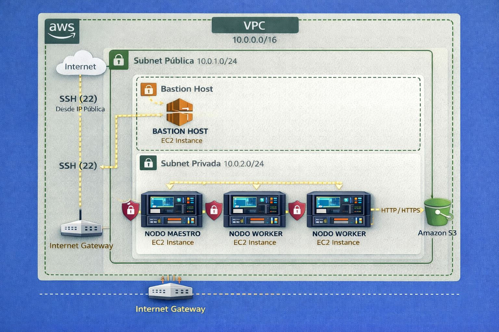

# 00 / Introducción al Proyecto

Este repositorio documenta el ejercicio práctico de arquitectura en la nube realizado junto a nuestro TL [Janner](https://gist.github.com/Janner-GP) **Riwi (Cohorte 6)**. El objetivo principal fue crear una infraestructura funcional de **Master / Workers** utilizando servicios de AWS, simulando un entorno real de equipo de datos.

---

## Contexto de la actividad

La actividad consistió en la configuración desde cero de un clúster de computación distribuida. El desafío no solo fue técnico (configuración de redes y servidores), sino también administrativo, delegando permisos específicos mediante **IAM** para cada miembro del equipo según su rol profesional.

### Objetivos principales:
* **Aislamiento de Red:** Configurar una VPC con subredes públicas y privadas para proteger los nodos de procesamiento (Workers).
* **Gestión de Identidades:** Implementar el principio de "Privilegio Mínimo" asignando políticas personalizadas a cada integrante.
* **Conectividad Segura:** Establecer un túnel SSH desde una instancia Master (Salto/Bastion) hacia los nodos Workers internos.
* **Simulación de Flujo de Datos:** Preparar el entorno para que Ingenieros y Analistas interactúen con servicios como S3 y EC2.

---

## Diagrama de los equipos con sus roles

Para que la infraestructura funcione correctamente, se definió una jerarquía de acceso. El **Líder** actúa como el administrador de la infraestructura, mientras que el resto del equipo se divide según su especialidad técnica.

### Estructura del Equipo y Responsabilidades

| Integrante               | Rol en el Proyecto       | Responsabilidad Principal                                                 |
|:-------------------------|:-------------------------|:--------------------------------------------------------------------------|
| **Ingeniero de Datos 1** | `Data Engineer / Master` | Configuración de red (VPC), creación de usuarios y despliegue del Master. |
| **Ingeniero de Datos 2** | `Data Engineer / Worker` | Configuración de `worker-1` y gestión de almacenamiento en S3.            |
| **Analista de Datos 1**  | `Data Analyst / Worker`  | Configuración de `worker-2` y análisis de consultas mediante Athena.      |
| **Analista de Datos 2**  | `Data Analyst / Worker`  | Configuración de `worker-3` y visualización de tendencias de datos.       |

---

## Arquitectura Lógica (Master-Workers)

La comunicación se estructuró de la siguiente manera para garantizar que los datos sensibles de los Workers no estuvieran expuestos directamente a internet:

1.  **El Master (`SUBNET-PUBLIC`):** Es el único punto de entrada. Recibe tráfico SSH desde el exterior (IP del administrador).
2.  **Los Workers (`SUBNET-PRIVATE`):** Viven en una red aislada. No tienen IP pública. Solo aceptan conexiones que provengan internamente del Security Group del Master.

> 💡 **Nota de Arquitectura**: Esta arquitectura de "Bastion Host" (el Master) es el estándar de la industria para administrar flotas de servidores de forma segura sin exponer cada nodo a ataques de fuerza bruta desde internet.

---