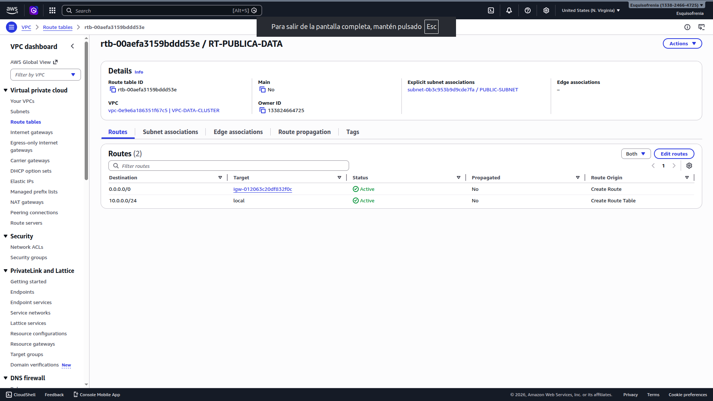

# 08 / Verificación final

Una vez completados todos los pasos anteriores, esta sección permite confirmar que el sistema está funcionando correctamente de principio a fin. Se revisa cada capa: la red, el acceso al Master y la comunicación del Master con cada Worker.

---

## 1 / Checklist del sistema completo

Antes de ejecutar cualquier comando, usar esta lista para confirmar que todos los componentes están en orden. Si alguno de estos puntos falla, no tiene sentido continuar con los siguientes.

### Infraestructura de red (Sección 5)

| # | Elemento | Estado esperado | Cómo verificarlo |
|:---|:---|:---|:---|
| ☐ | VPC `VPC-DATA-CLUSTER` | Available | Consola AWS → VPC → Your VPCs |
| ☐ | Subnet pública `SUBNET-PUBLIC-MASTER` | Available | Consola AWS → VPC → Subnets |
| ☐ | Subnet privada `SUBNET-PRIVATE-WORKERS` | Available | Consola AWS → VPC → Subnets |
| ☐ | Internet Gateway `IGW-DATA-CLUSTER` | Attached | Consola AWS → VPC → Internet Gateways |
| ☐ | Tabla de ruteo `RT-PUBLIC` asociada al Master | Asociada | Consola AWS → VPC → Route Tables → Subnet associations |
| ☐ | Security Group `SG-MASTER` con regla SSH `0.0.0.0/0` | Activo | Consola AWS → EC2 → Security Groups |
| ☐ | Security Group `SG-WORKERS` con regla SSH desde `SG-MASTER` | Activo | Consola AWS → EC2 → Security Groups |

### Instancias EC2 (Sección 6)

| # | Instancia | Estado esperado | Subnet | IP pública |
|:---|:---|:---|:---|:---|
| ☐ | `SRV-MASTER-DATA` | Running / 2/2 checks | `SUBNET-PUBLIC-MASTER` | ✅ Sí |
| ☐ | `SRV-WORKER-1` | Running / 2/2 checks | `SUBNET-PRIVATE-WORKERS` | ❌ No |
| ☐ | `SRV-WORKER-2` | Running / 2/2 checks | `SUBNET-PRIVATE-WORKERS` | ❌ No |
| ☐ | `SRV-WORKER-3` | Running / 2/2 checks | `SUBNET-PRIVATE-WORKERS` | ❌ No |

### Configuración SSH en el Master (Sección 7)

| # | Elemento | Estado esperado |
|:---|:---|:---|
| ☐ | Archivos `.pem` de los Workers en `/home/ubuntu/` | Presentes |
| ☐ | Permisos de los `.pem` | `-r--------` (400) |
| ☐ | Archivo `~/.ssh/config` con las 3 entradas de Workers | Presente |
| ☐ | Permisos del `config` | `-rw-------` (600) |

---

## 2 / Verificar la VPC y la red

Desde la **consola de AWS**, navegar a **VPC** y confirmar visualmente que todos los componentes están en el estado correcto.

### Verificar que la Tabla de Ruteo pública tiene la ruta a internet

1. Ir a **VPC → Route Tables**.
2. Seleccionar `RT-PUBLIC`.
3. Ir a la pestaña **Routes** y confirmar que existen estas dos entradas:

| Destino | Target | Estado |
|:---|:---|:---|
| `10.0.0.0/16` | local | active |
| `0.0.0.0/0` | `IGW-DATA-CLUSTER` | active |



> ⚠️ Si la ruta `0.0.0.0/0` no aparece o el target no es el Internet Gateway, el Master no tendrá salida a internet y Termius no podrá conectarse.

### Verificar que la Subnet Pública tiene Auto-assign Public IP activo

1. Ir a **VPC → Subnets**.
2. Seleccionar `SUBNET-PUBLIC-MASTER`.
3. En la pestaña **Details** confirmar que **Auto-assign public IPv4 address** dice `Yes`.

---

## 3 / Verificar el acceso al Master

Desde **Termius** en el computador local del Líder, intentar conectarse al Master.

1. Abrir Termius y hacer doble clic sobre el Host `SRV-MASTER-DATA`.
2. La terminal debe abrirse y mostrar el prompt:

```bash
ubuntu@ip-10-0-1-XXX:~$
```

3. Ejecutar el siguiente comando para confirmar la IP privada del Master:

```bash
hostname -I
```

La IP que aparece debe estar dentro del rango de la subnet pública (`10.0.1.X`).

4. Ejecutar este comando para confirmar que el Master tiene salida a internet:

```bash
ping -c 4 google.com
```

La salida esperada:

```
PING google.com (142.250.X.X) 56(84) bytes of data.
64 bytes from X.X.X.X: icmp_seq=1 ttl=55 time=X ms
64 bytes from X.X.X.X: icmp_seq=2 ttl=55 time=X ms
...
```

> ⚠️ Si el ping falla, verificar que el Internet Gateway esté asociado a la VPC y que la tabla de ruteo `RT-PUBLIC` tenga la ruta `0.0.0.0/0` apuntando al IGW.

---

## 4 / Verificar el acceso a los Workers desde el Master

Desde la **terminal del Master** en Termius, conectarse a cada Worker y confirmar que la conexión funciona correctamente.

### Worker 1

```bash
ssh worker-1
```

Prompt esperado al entrar:

```bash
ubuntu@ip-10-0-2-XXX:~$
```

Confirmar la IP privada del Worker:

```bash
hostname -I
```

La IP debe estar dentro del rango de la subnet privada (`10.0.2.X`) y coincidir con la que fue compartida en la sección 6.2.

Salir del Worker y volver al Master:

```bash
exit
```

### Worker 2

```bash
ssh worker-2
```

```bash
hostname -I
exit
```

### Worker 3

```bash
ssh worker-3
```

```bash
hostname -I
exit
```

### Resumen esperado

| Conexión | Comando | Resultado esperado |
|:---|:---|:---|
| Local → Master | Termius (doble clic) | Prompt `ubuntu@ip-10-0-1-XXX` |
| Master → Worker 1 | `ssh worker-1` | Prompt `ubuntu@ip-10-0-2-XXX` |
| Master → Worker 2 | `ssh worker-2` | Prompt `ubuntu@ip-10-0-2-XXX` |
| Master → Worker 3 | `ssh worker-3` | Prompt `ubuntu@ip-10-0-2-XXX` |

---

## 5 / Verificar que los Workers no tienen salida a internet

Este paso confirma que la arquitectura de red está correctamente aplicada: los Workers deben poder comunicarse dentro de la VPC pero **no** deben tener salida a internet.

Desde la sesión de cualquier Worker, ejecutar:

```bash
ping -c 4 google.com
```

La salida esperada es que el comando **no reciba respuesta** o muestre un error como:

```
ping: google.com: Temporary failure in name resolution
```

o simplemente que el ping quede esperando sin respuesta hasta que se cancele con `Ctrl + C`.

Esto confirma que:
- El Worker está en la subnet privada correctamente.
- La tabla de ruteo privada no tiene ruta hacia el Internet Gateway.
- La arquitectura Master/Workers está funcionando tal como fue diseñada.

> 💡 Si el ping al Worker sí llega a internet, significa que la instancia quedó en la subnet pública o que la tabla de ruteo privada tiene una ruta incorrecta hacia el IGW. Revisar la configuración de red de esa instancia en la consola de AWS.