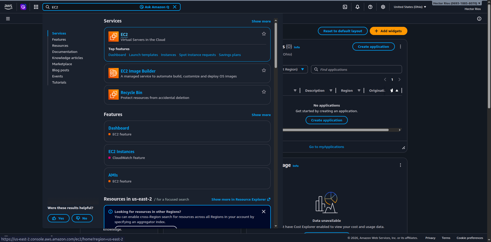
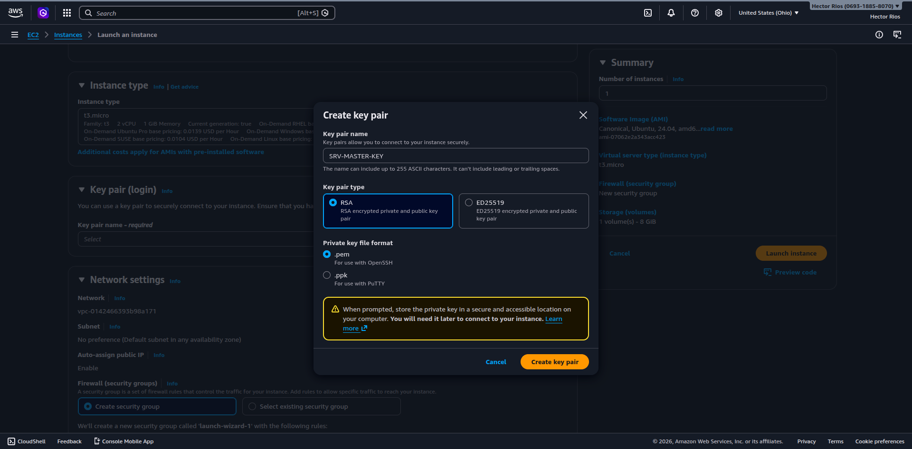
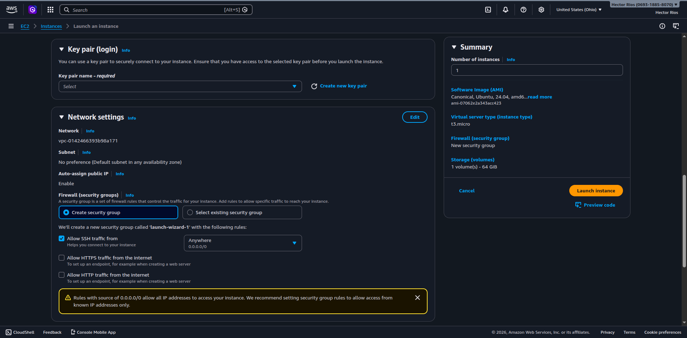
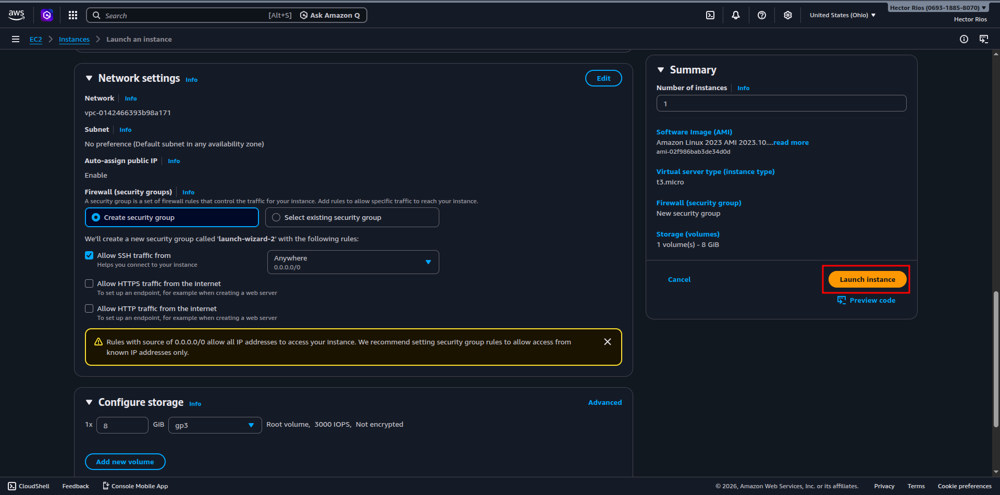
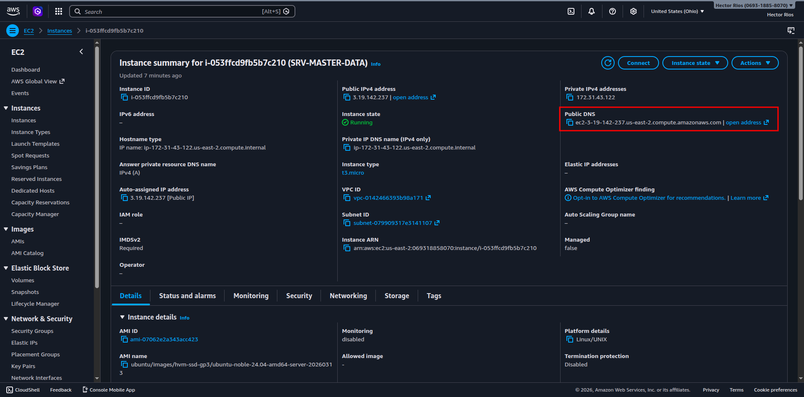

## 04 / Creación de las instancias EC2
El proceso de creación es el mismo para todos, lo que cambia es el nombre de la instancia, el IAM Role asignado y quién la crea. Por esa razón se divide en dos subsecciones.

---

## 4.1 / El Líder crea el Master

### Paso 1 / Ingresar a EC2 y lanzar una instancia

1. Iniciar sesión con el usuario IAM del Líder.
2. En la barra de búsqueda escribir `EC2` y seleccionar el servicio.

3. En el panel izquierdo ir a Instances → hacer clic en `Launch instances`.

---

### Paso 2 — Nombre de la instancia

En el campo **Name** escribir:

```text
SRV-MASTER-DATA
```

---

### Paso 3 / Elegir la AMI

En la sección **Application and OS Images** seleccionar:

```text
Ubuntu Server 22.04 LTS (HVM), SSD Volume Type
Architecture: 64-bit (x86)
```

> 💡 Verificar que diga Free tier eligible.

---

### Paso 4 / Tipo de instancia

En **Instance type** seleccionar:

```text
t3.micro
```

---

### Paso 5 / Crear el Key Pair

1. En la sección **Key pair (login)** hacer clic en `Create new key pair`.
2. Completar los campos:

| Campo                       | Valor            |
|:----------------------------|:-----------------|
| **Key pair name**           | `SRV-MASTER-KEY` |
| **Key pair type**           | RSA              |
| **Private key file format** | `.pem`           |


3. Hacer clic en Create key pair. El archivo .pem se descargará automáticamente.

> ⚠️ Este archivo se descarga una sola vez. Si se pierde, no es posible recuperarlo y se perderá el acceso a la instancia permanentemente.

---

### Paso 6 / Configurar Network settings

En la sección Network settings hacer clic en `Edit` y configurar así:

**Firewall (Security Group)**: seleccionar `Create security group`.

AWS mostrará tres opciones de tráfico entrante. Configurarlas de la siguiente manera:

| Regla                                     | Acción                                     | Motivo                                                            |
|:------------------------------------------|:-------------------------------------------|:------------------------------------------------------------------|
| **Allow SSH traffic from**                | ✅ Activar — origen: `Anywhere` `0.0.0.0/0` | Permite conectarse a la instancia por terminal desde cualquier IP |
| **Allow HTTPS traffic from the internet** | ☐ Dejar desactivado                        | No se expone ningún servicio web seguro en esta actividad         |
| **Allow HTTP traffic from the internet**  | ☐ Dejar desactivado                        | No se expone ningún servicio web en esta actividad                |


> ⚠️ AWS mostrará una advertencia en amarillo indicando que el origen 0.0.0.0/0 permite el acceso desde cualquier dirección IP. Para esta actividad académica es aceptable. En entornos productivos siempre se debe restringir a IPs conocidas.

---

#### Paso 7 / Almacenamiento

En la actividad Janner nos dijo que pusieramos esto:

```text
64 GiB — gp3
```

---

#### Paso 8 / Lanzar la instancia

1. Revisar el resumen en el panel derecho.
2. Hacer clic en `Launch instance`.
3. Hacer clic en `View all instances`.

4. Esperar a que el estado cambie de `Pending` → `Running` y que Status check muestre `2/2 checks passed`.

---

#### Paso 9 / Obtener el DNS público y compartirlo con el equipo

1. Hacer clic sobre la instancia `master`.
2. En la pestaña **Details** localizar el campo **Public IPv4 DNS**.
3. Copiarlo y enviarlo al canal del equipo junto con el nombre de la instancia:


```text
Instancia: master
DNS: ec2-XX-XX-XX-XX.compute-1.amazonaws.com
```

---

## 4.2 / Cada Worker crea su instancia

El proceso es exactamente el mismo que el del Master. Las únicas diferencias son el nombre de la instancia, el IAM Role asignado y que al final cada Worker comparte su DNS con el Líder.

| Integrante           | Nombre de la instancia |
|:---------------------|:-----------------------|
| Ingeniero de Datos 2 | `worker-1`             |
| Analista de Datos 1  | `worker-2`             |
| Analista de Datos 2  | `worker-3`             |